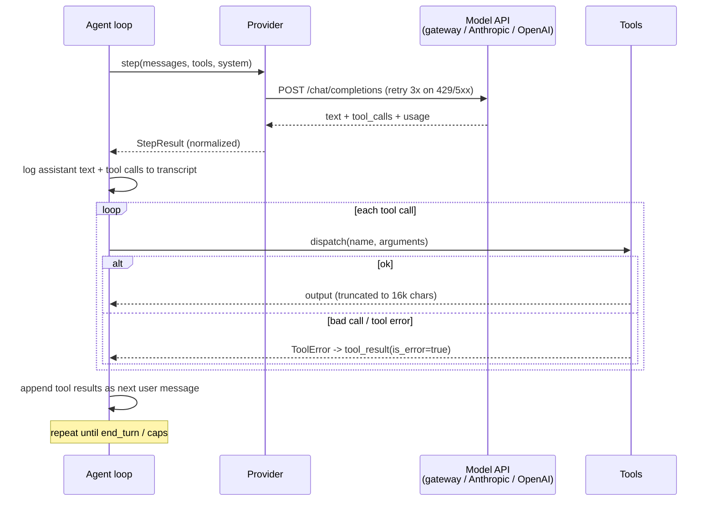
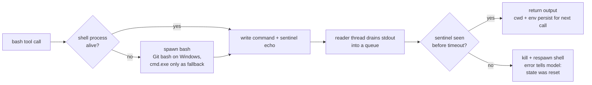

# nano-harness — How It Works

One loop, three tools, two providers. ~850 physical lines total. This doc traces
exactly what happens when you run `nano run "fix the bug"`, so you can see where
efficiency lives and where it leaks.

## The pipeline, step by step

1. **CLI** (`cli.py`) — parses args, forces UTF-8 stdout, routes the model name
   to a provider: `--base-url` set → `OpenAIProvider` against any
   OpenAI-compatible endpoint (ASU gateway, vLLM, ollama); name starts with
   `claude` → `AnthropicProvider`; anything else → `OpenAIProvider`.
2. **Agent loop** (`agent.py`) — the core. Repeats: send conversation → get
   text + tool calls → execute tools → append results → repeat. Stops on
   `end_turn`, iteration cap (30), or context cap (200k tokens/step).
3. **Tools** (`tools.py`) — `bash` (persistent shell: bash everywhere, incl.
   Windows via Git bash; cmd.exe fallback only), `read_file` (line-numbered),
   `edit_file` (exact unique string replacement). Malformed calls come back as
   errors the model can fix, never crashes.
4. **Guards** — four things keep a run from dying or lying:
   - *Truncation*: conversation over ~120k chars → oldest tool outputs replaced
     with `[truncated]` placeholders (structure kept).
   - *Retry*: 429/5xx/connection errors retried 3× with backoff.
   - *Continuation*: output cut off mid-response → "continue" nudge, not false
     success.
   - *Verify pass*: the first "done" gets challenged once — re-read the task,
     run the tests, then finish.
5. **Result** — `AgentResult` with stop reason, iteration count, token totals,
   and a full transcript (every message, tool call, and tool result).

## GroundTruth engine lifecycle

When `gt_root` is set, GroundTruth participates at the decision boundaries of
the loop itself: task start, every completed tool observation, request
construction, the next model response, and the penultimate submit decision.
It is therefore the deterministic evidence engine for the GT arm, not a
post-run tracer. The language model still supplies reasoning; GT supplies
repository facts, deterministic checks, routing, and completion evidence.

### Central Mini-SWE action boundary

The active Terminal-Bench arm is two-sided and in-process:

```text
model.query
  -> typed ProposedAction (newline-aware; heredoc/code bodies opaque)
  -> deterministic preflight (default PASS; paid mode SHADOW)
  -> environment.exec
  -> source/workspace revisions + attributed validation status
  -> postflight effects and one-shot semantic decision frame
  -> exact provider-prepared request receipt
  -> next model.query
```

GT does not predict an action before model selection. Validation PASS/FAIL is
recorded only when the terminal foreground validator owns the shell return
code. The active loop is two-sided: typed preflight (SHADOW by default), host
execution, postflight observation, progress/completion control, then the next
model request. Deterministic provider-view compaction is bounded: it removes
no assistant turn or distinct reasoning. Oversized tool observations are
bounded even when recent, exact duplicate results are represented append-only,
and only old tool bodies may become hash/return-code receipts. No generic
state frame is inserted. The exact provider-prepared request is budgeted before
dispatch; an over-budget request is not sent. The audit history is never
mutated. The host switch is `integration_mode=off|audit|active`.

Task paths are normalized once into typed roles. Only high-confidence `OUTPUT`
resources affect task-deliverable progress; `INPUT` resources never do.
Output-existence probes can advance controller progress but cannot cover a task
obligation or issue an auto-submit certificate. `BUDGET_RISK` persists through
mere observation novelty and clears only after authored source or confirmed
task-output change.

The two audit streams answer different questions:

- `gt_ledger.jsonl`: which exact evidence bytes were sealed and delivered.
- `gt_attribution.jsonl`: which of the 17 direct mechanisms had an opportunity,
  fired, stayed dark, was suppressed, reached the provider request, and was
  linked to the next response.

Request exposure is found by structurally reading message block lists.
Trajectories are not used as the delivery witness, and response linkage is not
overclaimed as semantic consumption or benchmark causality. The next response's
tool-call IDs and names are linked to the exposed delivery IDs without retaining
raw model text or tool arguments. A paired GT-off run is the comparison needed
to attribute a behavior or reward delta to the GT arm.

## The main loop


## One iteration, on the wire



## The persistent shell



Key property: `cd` and `export` survive between calls — the model works in a
real session, not one-shot commands. On timeout the whole shell dies and the
model is told its state is gone.

`read_file` and `edit_file` resolve relative paths against the persistent
shell's live cwd, including Git Bash's Windows path form. A preceding `cd`
therefore applies consistently to all three tools.

## Where the efficiency lives (and leaks)

| Mechanism | Status | Effect |
|---|---|---|
| Prompt caching (`cache_control`) | Anthropic direct only — **inactive through the gateway** (all head-to-head runs show `cache_read=0`) | biggest cost leak on long tasks |
| Iteration cap (30) | active | load-bearing for weak models (haiku hit it on all 3 tasks) |
| Tool output truncation (16k chars) | active | keeps one noisy command from flooding context |
| Conversation truncation (120k chars) | active | keeps long runs inside the window |
| Verify pass (1 extra step) | active | buys correctness for ~1 iteration of cost |
| Loop/thrash detection | **none** | haiku burned 30 iterations on 1-line fixes; nothing stops identical repeated calls |

## GroundTruth repository-intelligence boundary

The active Mini-SWE treatment adds a host-owned deterministic intelligence
path around the stock model loop:

```text
task container --bounded mirror transfer--> RepositorySession
  -> certified graph.db + manifest at source revision S
  -> task-linked structural retrieval
  -> ContextFrontierCompiler(history, S)
  -> exact provider request N
  -> typed ProposedAction
  -> SHADOW preflight
  -> original environment.exec
  -> postflight diff/validation/features
  -> incremental graph refresh at source revision S+1
  -> next frontier/request
```

The graph is valid only when the shipped binary, schema, FTS tables, source
coverage, node/edge counts, graph hash, and validation-relevant source revision
are certified. Supported index suffixes come from the same language registry
used by workspace capture and source revision. A language can be authored
source without being structurally supported; that state is an explicit
unsupported/incomplete-coverage failure, never a license to manufacture regex
symbols. COBOL and Scheme are certified parser-backed extensions in the
vendored source, and every workflow builds that source before the graph
fixture; Racket and other unshipped grammars remain fail-closed.

The repository frontier is selective retrieval, not a task-start dump. It
compares certified graph facts with the exact provider view and emits the
smallest new decision frame: no more than three facts, 1,200 characters per
call, or 6,000 characters per task. Facts require a concrete path, positive
line, symbol, current graph/source revisions, semantic certainty, and retrieval
relevance. Definitions precede callers/references; already represented,
duplicate, stale, low-precision, unhealthy, or over-budget facts receive an
explicit non-delivery disposition. Complete facts are omitted rather than
truncated.

This architecture follows three established results: interface design changes
software-agent behavior ([SWE-agent](https://arxiv.org/abs/2405.15793));
localization/repair/validation decomposition can outperform gratuitous agent
complexity ([Agentless](https://arxiv.org/abs/2407.01489)); and iterative
repository retrieval is stronger than indiscriminate repository context
([RepoCoder](https://arxiv.org/abs/2303.12570)). The strict context budget also
reflects evidence that relevant information can become harder to use inside
long prompts ([Lost in the Middle](https://arxiv.org/abs/2307.03172)). These
papers motivate the interface; they do not prove this implementation improves
the current benchmark.

Operational failure and experimental validity are deliberately separate. A
graph failure does not block the model from executing commands. It does mark
the active treatment invalid. Likewise, a task with zero incremental visible
repository facts is not counted as a healthy GT task, even if private feature
receipts exist. The merged paid workflow reports this per task and fails the
promotion gate while still uploading every trajectory and receipt.

The paid workflow additionally enables a pre-provider graph gate. Before the
first model call, `require_graph_ready=true` requires a current, schema-valid,
non-empty graph with complete authored-source coverage and matching source and
graph certification. Missing or invalid substrate exits with
`RepositoryGraphGateFailed` and zero provider calls; the receipt retains the
failure reasons. This is the early guard against accidentally measuring a
graph-less sidecar. The later merge audit remains necessary for frontier
visibility, payload correctness, timing, and outcome preservation.
