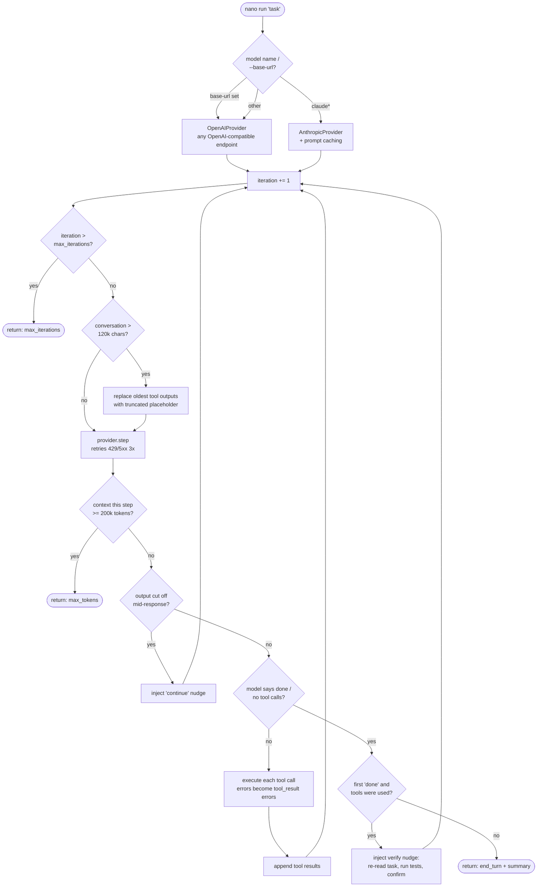
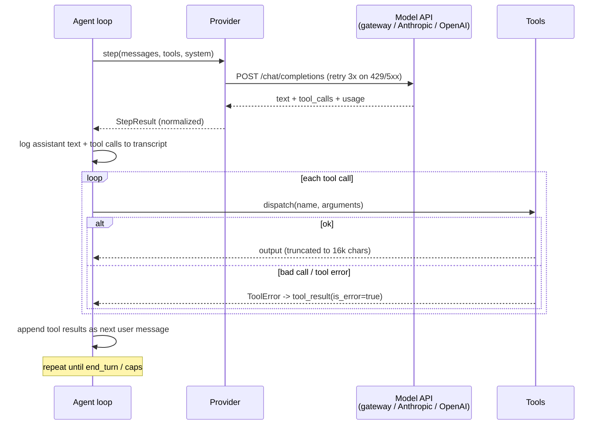
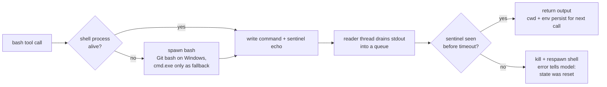

# nano-harness — How It Works

One loop, three tools, two providers. ~850 physical lines total. This doc traces
exactly what happens when you run `nano run "fix the bug"`, so you can see where
efficiency lives and where it leaks.

## The pipeline, step by step

1. **CLI** (`cli.py`) — parses args, forces UTF-8 stdout, routes the model name
   to a provider: `--base-url` set → `OpenAIProvider` against any
   OpenAI-compatible endpoint (ASU gateway, vLLM, ollama); name starts with
   `claude` → `AnthropicProvider`; anything else → `OpenAIProvider`.
2. **Agent loop** (`agent.py`) — the core. Repeats: send conversation → get
   text + tool calls → execute tools → append results → repeat. Stops on
   `end_turn`, iteration cap (30), or context cap (200k tokens/step).
3. **Tools** (`tools.py`) — `bash` (persistent shell: bash everywhere, incl.
   Windows via Git bash; cmd.exe fallback only), `read_file` (line-numbered),
   `edit_file` (exact unique string replacement). Malformed calls come back as
   errors the model can fix, never crashes.
4. **Guards** — four things keep a run from dying or lying:
   - *Truncation*: conversation over ~120k chars → oldest tool outputs replaced
     with `[truncated]` placeholders (structure kept).
   - *Retry*: 429/5xx/connection errors retried 3× with backoff.
   - *Continuation*: output cut off mid-response → "continue" nudge, not false
     success.
   - *Verify pass*: the first "done" gets challenged once — re-read the task,
     run the tests, then finish.
5. **Result** — `AgentResult` with stop reason, iteration count, token totals,
   and a full transcript (every message, tool call, and tool result).

## The main loop

## One iteration, on the wire

## The persistent shell

Key property: `cd` and `export` survive between calls — the model works in a
real session, not one-shot commands. On timeout the whole shell dies and the
model is told its state is gone.

**Known limitation:** `read_file`/`edit_file` resolve relative paths against
the *process* cwd, not the shell's live cwd. A model that `cd`s in bash then
edits a relative path hits the wrong file. Documented, deferred (fix needs
MSYS path translation on Windows).

## Where the efficiency lives (and leaks)

| Mechanism | Status | Effect |
|---|---|---|
| Prompt caching (`cache_control`) | Anthropic direct only — **inactive through the gateway** (all head-to-head runs show `cache_read=0`) | biggest cost leak on long tasks |
| Iteration cap (30) | active | load-bearing for weak models (haiku hit it on all 3 tasks) |
| Tool output truncation (16k chars) | active | keeps one noisy command from flooding context |
| Conversation truncation (120k chars) | active | keeps long runs inside the window |
| Verify pass (1 extra step) | active | buys correctness for ~1 iteration of cost |
| Loop/thrash detection | **none** | haiku burned 30 iterations on 1-line fixes; nothing stops identical repeated calls |
